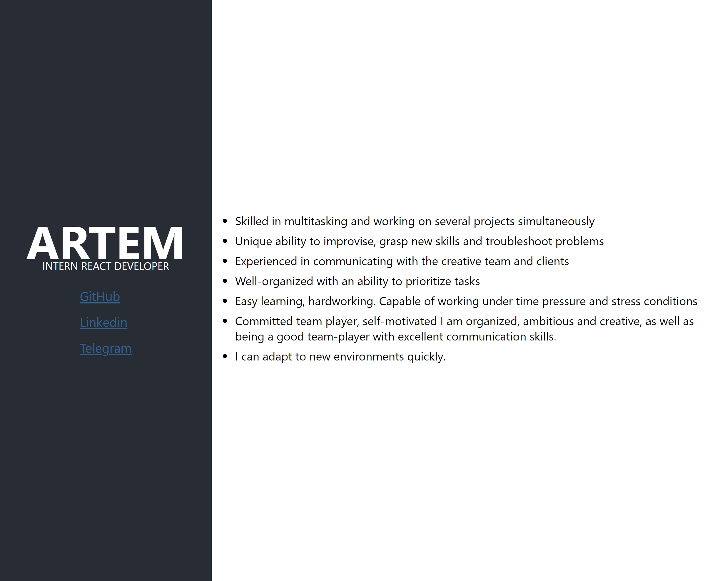
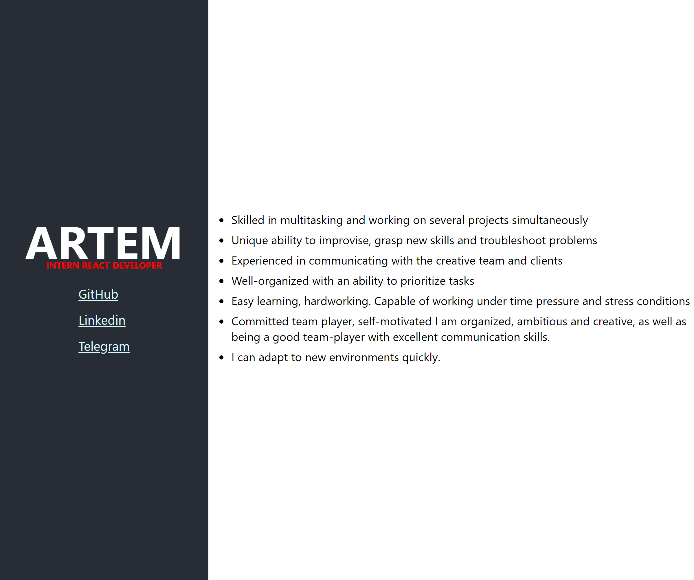

### 1 Workshop: A new project with create-react-app

The result in the screenshot, that's what I got from the first task.

### 2 Lecture: What is React Component

I thought a bit and reworked the architecture of my project, look at the screenshots, the question is still e. I want to do it with my eyes closed). I saw a mistake, tell me.

